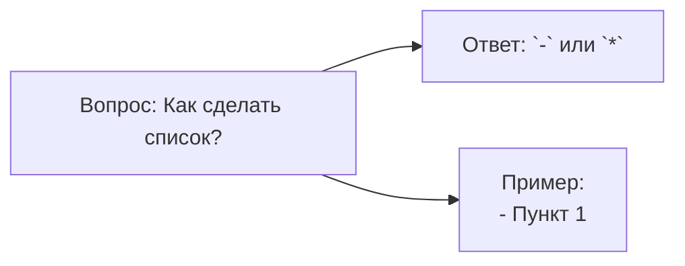
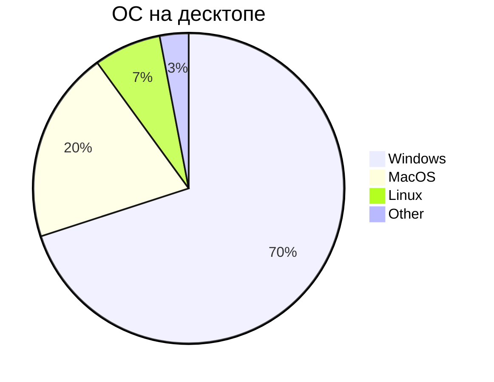

## Mermaid

**Mermaid** - это сильно упрощённый и далёкий аналог **UML** - специальный язык описани блок-схем, графиков и диаграмм с их визуализацией.

> **Самсостоятельно доделать это ридми**

### Блок схемы

#### Базовая структура 1

* `flowchart` - блок-схема
* `LR` - направление вправо
* `A[],B[],C[]` - прямоугольник
* --> - стрелка связи

#### Базовая структура 2

#### Полный синтаксис блок-схем

### Диаграмма последовательности

### Диаграмма класса

### Диаграмма Ганта

### Граф зависимостей

### Диаграмма состояний

### Юзер-джайрни

### Кастомизация стилей

#### Классы CSS

#### Интерактивность

### Круговая диаграмма

